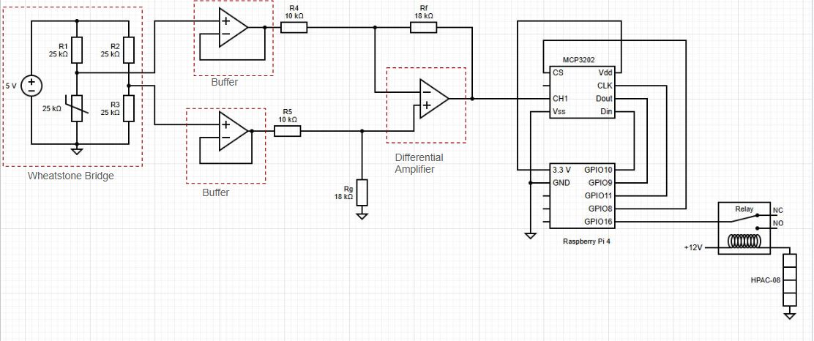

# TemperatureDAQ

TemperatureDAQ is a Raspberry Pi-based temperature data acquisition and control system. It reads temperature data using an ADC, controls a relay for heating, logs data to a CSV file, and provides basic logic for heater control.

## Features

- Reads temperature from an analog sensor via MCP3202 ADC
- Controls a relay for heater activation
- Logs temperature data, time, and heater status to a CSV file
- Converts voltage readings to temperature
- Uses MCP4921 DAC for output
- Simple control logic to maintain a set temperature

## Requirements

- Raspberry Pi (with GPIO access)
- MCP3202 ADC and MCP4921 DAC
- Python 3
- Required Python packages:
  - RPi.GPIO
  - spidev
  - PyQt6

## Hardware Setup

The circuit was built to accept an analog signal from the wheatstone bridge, discretize the signal for processing in a Pi 4 with MCP3202 and produce an analog output with a MCP4921 to control a relay which controls the heating element.



The wheatstone bridge is used for

- Measure change in resistance as a change in voltage accurately. 
- Balanced circuit provides 0 V.  

The differential voltage from the wheatstone bridge is passed to differential amplfiier.

- This boost the signal to a readable voltage level.
- Diff amp has a gain of 1.8.

## Software Setup

SPI is used as a communication protocol between MCP3202 and Raspberry Pi 4.

Clone this repo 

```
git clone https://github.com/IlhanHashimEng/TemperatureDAQ.git
```

Move to src

```
cd src
```

Run python script

```
python main.py
```

